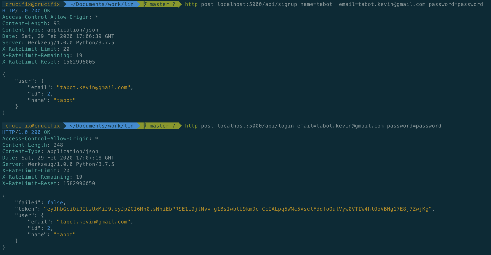

# URL shortener API written in Python using Flask

Project Requirements
----------------------------

- About 1,000 daily active users creating 5 to 10 short URLs per day.

- The applications will have a predicted daily volume of 100,000 daily visitors clicking the short URL links.

- There must be a REST API to create, retrieve, update, and delete shortened URLs. Customers are given an API token for use with the service.

For this example, the link shortening service will have the domain jit.lc

There are a few rules for shortened URLs:

- The full URL provided by the customer (e.g. https://www.google.com) will always be shortened to an encoded value with our domain (e.g. https://jit.lc/xCd5a).

- Shortened URLs must be unique for each customer. If two different customers create a short URL to the same destination (customer A and customer B both create short URLs to https://www.google.com), each customer is given a unique shortened URL.

- Duplicate shortened links for each customer are not allowed. If a customer attempts to create a new shortened link for a URL that already exists, the existing shortened link will be provided (e.g. a link for https://www.google.com already exists. Customer tries to create a new link to the same place, we return the existing short URL).

How do I get set up
----------------------------

* Environment Setup
	- $ python3 -m venv venv
	- $ source venv/bin/activate
	- export FLASK_APP=run
	- export CONFIG=development
	- Install Redis server

* Install Dependencies
	- $ pip install -r requirements.txt

* Database configuration 
	- $ python manage.py db init 
	- $ python manage.py initdb 
	- $ python manage.py db migrate 
	- $ python manage.py db upgrade

* Start up the Server
	- $ flask run or python run.py
	- $ redis-server (In another terminal)

* Main Routes for the projects are stored in the app/api directory under seperate filenames for each module
* To play around a little bit e.g register new users and login using httpie (http) python client
	- $ pip install httpie (After installation you should have http as command on your computer)
	- $ http post localhost:5000/api/signup name=tabot  email=user@email.com password=password
	  (The Above command will register a new user and return the user info in json)
	- $ http post localhost:5000/api/login email=user@email.com password=password
	(The Above command will login a new user and return the user info in json including an auth token use to interacted locked routes)
	- $ http --auth token: [method] localhost:5000/api/[secured_rooute]
	(To access any secured route use the token gotten from login and dont forget to use colon after the token e.g)
	- $ http --auth eyJhbGciOiJIUzI1NiJ9.eyJpZCI6M30.0Uybn2UP-TBU5No040Ai4jnHl2GBwhpTMajgQU-n0xs: get localhost:5000/api/xCd5a (Redirects to long url whose short url is xCd5a)
	- $ http --auth eyJhbGciOiJIUzI1NiJ9.eyJpZCI6M30.0Uybn2UP-TBU5No040Ai4jnHl2GBwhpTMajgQU-n0xs: post localhost:5000/api/shorten url=https:google.com (Create short url for https:google.com)

Proof
----------------------------

Who do I talk to
----------------------------
* Repo owner or admin (Tabot Kevin | tabot.kevin@gmail.com)
